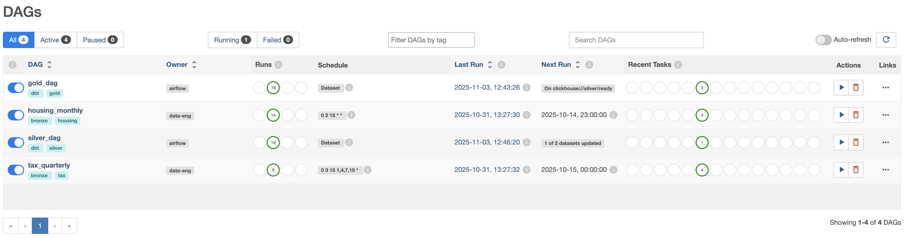
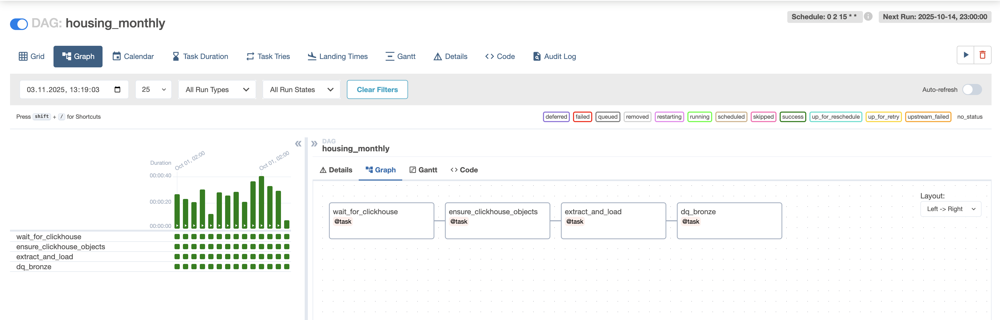
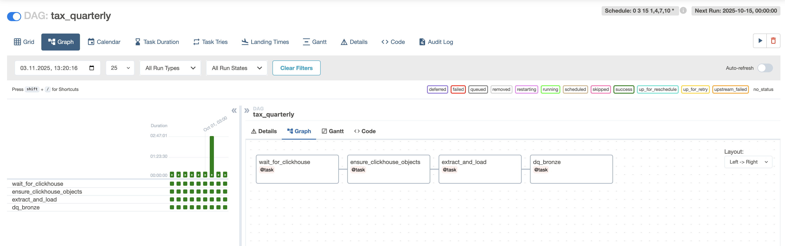
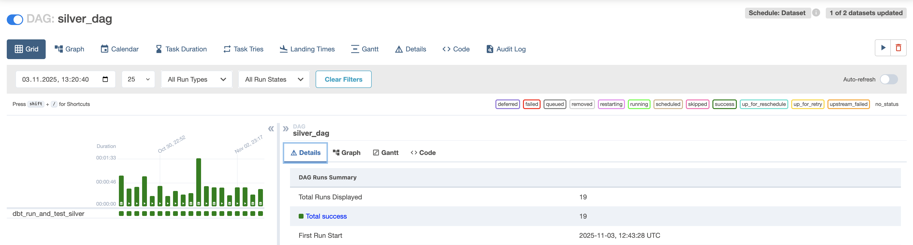
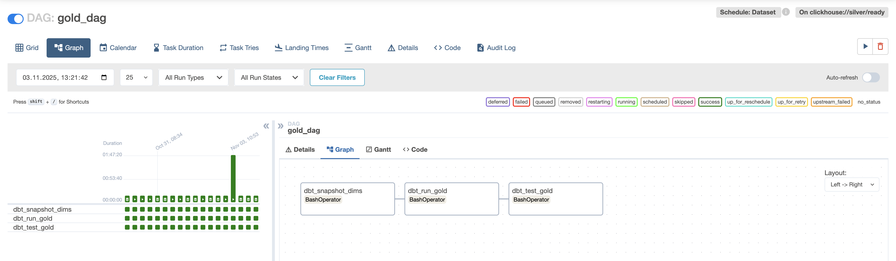

# Accommodation Analytics: Data Eng course project

**Quick links:**  
- [Overview](#overview)
- [Directories](#directories)
- [How to use](#how-to-use)
- [Gold Star Schema](#gold-star-schema)
- [DBT Runs](#dbt-runs)
- [Airflow DAGs](#airflow-dags)
- [Example Queries](#example-queries)
  - [1) Types → turnover per bed](#q1-types-turnover-per-bed)
  - [2) Features → turnover per bed](#q2-features-turnover-per-bed)
  - [3) Company performance](#q3-company-performance)
  - [4) Regional turnover per bed](#q4-regional-turnover-per-bed)
  - [5) Employees per 100 beds](#q5-employees-per-100-beds)
- [Licensing / Sources](#licensing)
  
<a id="overview"></a>
## Overview
Goal: identify which locations and accommodation characteristics are most attractive for Estonian accommodation businesses, and how capacity relates to financial performance.

**Datasets**
- **EMTA** (quarterly, company-level): turnover, (labour/state) taxes, employees — joined by `registry_code`.
- **VisitEstonia / National Tourism IS — Housing** (monthly, property-level): accommodation metadata, capacity (beds/rooms), amenities, and `Ettevõtte registrikood`.

> Note: EMTA is **company-level**. We **do not** store property-level turnover. Any distribution to properties (e.g., proportional by beds) computed in queries and is **generalized** due to limited data.

<a id="directories"></a>
## Directories (essentials)

- `airflow/` — Production orchestration (DAGs) + ClickHouse DDL bootstrap.
- `dbt/models/silver/` — Cleaned staging (“Silver”) models from bronze.
- `dbt/models/gold/` — Star-schema (“Gold”) facts & dimensions, including general tests in `schema.yml`.
- `dbt/snapshots/` — SCD2 snapshots feeding Gold dims.
- `dbt/tests/` — Lightweight data tests (specific).
- `src/ingestion/` — Ingestion loaders & helpers for housing/tax sources.
- `docker/` & `compose.yml` — Local runtime images and services wiring.

---

<a id="how-to-use"></a>
## How to use
* Follow this technical [README.md](tourism-dwh/README.md) for setup, schema definitions _etc_.
> If you are on Github Web, use this [link to README.md](https://github.com/ronv3/data-eng-group12/blob/main/tourism-dwh/README.md)

---

<a id="gold-star-schema"></a>
## Gold Layer — Star Schema (Basics)

This is the **analytics layer** built from Silver staging via dbt. Dimensions are **SCD2** (current flag + effective windows), and facts carry surrogate keys for consistent joins.

### Facts

#### `gold.fact_company_quarter`
- **Grain:** `company_sk × quarter_sk`
- **FKs:** `company_sk`, `quarter_sk`
- **Measures:**  
  `turnover_eur`, `state_taxes_eur`, `labour_taxes_eur`, `employees_cnt`

#### `gold.fact_accommodation_snapshot`
- **Grain:** `accommodation_sk × quarter_sk` (as-of snapshot)
- **FKs:** `accommodation_sk`, `company_sk`, `quarter_sk`, `geo_sk`
- **Measures:**  
  `rooms_cnt`, `beds_total`, `caravan_spots`, `tent_spots`

---

### Dimensions

#### `gold.dim_company` (SCD2)
- **PK:** `company_sk`
- **BK / ID:** `company_id` (normalized registry code)
- **Attributes:** `name`, `activity`, `website`, `email`, `phone`, `address`,
  `municipality`, `county`, `effective_from`, `effective_to`, `is_current`

#### `gold.dim_accommodation` (SCD2)
- **PK:** `accommodation_sk`
- **BK:** `accommodation_bk` (`property_bk|name`)
- **Attributes:** `property_bk_norm`, `type`, `category`, `stars`,
  `effective_from`, `effective_to`, `is_current`

#### `gold.dim_feature`
- **PK:** `feature_sk`
- **Attributes:** `name`

#### `gold.bridge_accommodation_feature` (M:N)
- **Columns:** `accommodation_sk`, `feature_sk`

#### `gold.dim_geography`
- **PK:** `geo_sk`
- **Attributes:** `region`, `island`

#### `gold.dim_calendar_quarter`
- **PK:** `quarter_sk`
- **Attributes:** `quarter_start` (UTC)

---

### Join Paths

- `fact_accommodation_snapshot.company_sk  → dim_company.company_sk`
- `fact_accommodation_snapshot.accommodation_sk → dim_accommodation.accommodation_sk`
- `fact_accommodation_snapshot.geo_sk     → dim_geography.geo_sk`
- `fact_accommodation_snapshot.quarter_sk → dim_calendar_quarter.quarter_sk`
- `fact_company_quarter.company_sk        → dim_company.company_sk`
- `fact_company_quarter.quarter_sk        → dim_calendar_quarter.quarter_sk`

> SCD2 is maintained via dbt **snapshots** (`gold.accommodation_snapshot`, `gold.company_snapshot`), and Gold dims are rebuilt from those snapshots.

---

# Technical correctness overview

<a id="dbt-runs"></a>
## DBT Runs
- DBT runs for all models and tests (including tests, 1 warning) - not including snapshots (running these when not needed is not recommended)
```
13:12:46  Running with dbt=1.7.18
13:12:46  Registered adapter: clickhouse=1.7.7
13:12:47  Found 12 models, 2 snapshots, 5 tests, 2 sources, 0 exposures, 0 metrics, 545 macros, 0 groups, 0 semantic models
13:12:47  
13:12:48  Concurrency: 1 threads (target='dev')
13:12:48  
13:12:48  1 of 19 START sql table model `default_gold`.`dim_calendar_quarter` ............ [RUN]
13:12:48  1 of 19 OK created sql table model `default_gold`.`dim_calendar_quarter` ....... [OK in 0.25s]
13:12:48  2 of 19 START sql table model `default_silver`.`stg_housing_accommodation` ..... [RUN]
13:12:48  2 of 19 OK created sql table model `default_silver`.`stg_housing_accommodation`  [OK in 0.19s]
13:12:48  3 of 19 START sql table model `default_silver`.`stg_housing_features` .......... [RUN]
13:12:48  3 of 19 OK created sql table model `default_silver`.`stg_housing_features` ..... [OK in 0.14s]
13:12:48  4 of 19 START sql table model `default_silver`.`stg_tax_company_quarter` ....... [RUN]
13:12:54  4 of 19 OK created sql table model `default_silver`.`stg_tax_company_quarter` .. [OK in 5.64s]
13:12:54  5 of 19 START sql table model `default_gold`.`dim_geography` ................... [RUN]
13:12:54  5 of 19 OK created sql table model `default_gold`.`dim_geography` .............. [OK in 0.11s]
13:12:54  6 of 19 START snapshot `gold`.`accommodation_snapshot` ......................... [RUN]
13:12:54  6 of 19 OK snapshotted `gold`.`accommodation_snapshot` ......................... [OK in 0.44s]
13:12:54  7 of 19 START sql table model `default_gold`.`dim_feature` ..................... [RUN]
13:12:54  7 of 19 OK created sql table model `default_gold`.`dim_feature` ................ [OK in 0.09s]
13:12:54  8 of 19 START sql table model `default_silver`.`stg_company_latest` ............ [RUN]
13:12:55  8 of 19 OK created sql table model `default_silver`.`stg_company_latest` ....... [OK in 0.38s]
13:12:55  9 of 19 START sql table model `default_gold`.`dim_accommodation` ............... [RUN]
13:12:55  9 of 19 OK created sql table model `default_gold`.`dim_accommodation` .......... [OK in 0.17s]
13:12:55  10 of 19 START snapshot `gold`.`company_snapshot` .............................. [RUN]
13:12:59  10 of 19 OK snapshotted `gold`.`company_snapshot` .............................. [OK in 3.58s]
13:12:59  11 of 19 START test not_null_dim_accommodation_accommodation_sk ................ [RUN]
13:12:59  11 of 19 PASS not_null_dim_accommodation_accommodation_sk ...................... [PASS in 0.10s]
13:12:59  12 of 19 START sql table model `default_gold`.`dim_company` .................... [RUN]
13:13:04  12 of 19 OK created sql table model `default_gold`.`dim_company` ............... [OK in 4.97s]
13:13:04  13 of 19 START sql table model `default_gold`.`bridge_accommodation_feature` ... [RUN]
13:13:04  13 of 19 OK created sql table model `default_gold`.`bridge_accommodation_feature`  [OK in 0.10s]
13:13:04  14 of 19 START test not_null_dim_company_company_sk ............................ [RUN]
13:13:04  14 of 19 PASS not_null_dim_company_company_sk .................................. [PASS in 0.04s]
13:13:04  15 of 19 START sql table model `default_gold`.`fact_accommodation_snapshot` .... [RUN]
13:13:04  15 of 19 OK created sql table model `default_gold`.`fact_accommodation_snapshot`  [OK in 0.39s]
13:13:04  16 of 19 START sql table model `default_gold`.`fact_company_quarter` ........... [RUN]
13:13:08  16 of 19 OK created sql table model `default_gold`.`fact_company_quarter` ...... [OK in 3.53s]
13:13:08  17 of 19 START test fact_accommodation_snapshot_no_negatives ................... [RUN]
13:13:08  17 of 19 PASS fact_accommodation_snapshot_no_negatives ......................... [PASS in 0.04s]
13:13:08  18 of 19 START test relationships_fact_accommodation_snapshot_geo_sk__geo_sk__ref_dim_geography_  [RUN]
13:13:08  18 of 19 WARN 1008 relationships_fact_accommodation_snapshot_geo_sk__geo_sk__ref_dim_geography_  [WARN 1008 in 0.07s]
13:13:08  19 of 19 START test relationships_fact_accommodation_snapshot_quarter_sk__quarter_sk__ref_dim_calendar_quarter_  [RUN]
13:13:08  19 of 19 PASS relationships_fact_accommodation_snapshot_quarter_sk__quarter_sk__ref_dim_calendar_quarter_  [PASS in 0.06s]
13:13:08  
13:13:08  Finished running 12 table models, 2 snapshots, 5 tests in 0 hours 0 minutes and 21.13 seconds (21.13s).
13:13:08  
13:13:08  Completed with 1 warning:
13:13:08  
13:13:08  Warning in test relationships_fact_accommodation_snapshot_geo_sk__geo_sk__ref_dim_geography_ (models/gold/schema.yml)
13:13:08  Got 1008 results, configured to warn if != 0
13:13:08  
13:13:08    compiled Code at target/compiled/tourism_dwh/models/gold/schema.yml/relationships_fact_accommodati_5622f2717015551c4516305f0f70c03b.sql
13:13:08  
13:13:08  Done. PASS=18 WARN=1 ERROR=0 SKIP=0 TOTAL=19
```

<a id="airflow-dags"></a>
## Airflow DAGs Overview

### All DAGs overview

---
### Bronze layer data ingestion DAGs – housing (scheduled monthly), tax (scheduled quarterly)


---
### Silver level DAG

---
### Gold level DAG


---

<a id="example-queries"></a>
## Queries to business questions with results from Database

<a id="q1-types-turnover-per-bed"></a>
### 1) Which accommodation types drive the highest turnover per bed by quarter?
**Who cares:** hotel/hostel operators, pricing teams, tourism board.

**SQL**
```sql
SELECT
  da.type,
  fas.quarter_sk,
  toFloat64(sum(fcq.turnover_eur)) / nullIf(sum(fas.beds_total), 0) AS turnover_per_bed,
  sum(fas.beds_total) AS beds_total
FROM default_gold.fact_accommodation_snapshot AS fas
INNER JOIN default_gold.dim_accommodation AS da
  ON (da.accommodation_sk = fas.accommodation_sk) AND (da.is_current = 1)
INNER JOIN default_gold.fact_company_quarter AS fcq
  ON (fcq.company_sk = fas.company_sk) AND (fcq.quarter_sk = fas.quarter_sk)
GROUP BY da.type, fas.quarter_sk
ORDER BY fas.quarter_sk ASC, turnover_per_bed DESC
```

**Result**
```
| type                 |   quarter_sk | turnover_per_bed   |   beds_total |
|:---------------------|-------------:|:-------------------|-------------:|
| Elamusmajutus        |        20253 | 63,649.364964      |          548 |
| Puhkemaja            |        20253 | 30,624.981034      |         5747 |
| Hostel               |        20253 | 18,687.642747      |         2592 |
| Motell               |        20253 | 14,514.736111      |           72 |
| Kulalistemaja        |        20253 | 10,197.143262      |         2471 |
| Hotell               |        20253 | 8,156.406583       |        26157 |
| Kulaliskorter        |        20253 | 7,988.124901       |         1257 |
| Puhkekula, karavanid |        20253 | 3,444.224          |         4750 |
| Kodumajutus          |        20253 | 1,503.49454        |          641 |
```
---

<a id="q2-features-turnover-per-bed"></a>
### 2) Which features correlate with higher turnover per bed?
*(e.g., Mullivann, sauna, spa) – last 4 quarters or all-time as-is.*  
**Who cares:** product/amenities owners, capex planners, marketers.

**SQL**
```sql
SELECT
  f.name AS feature,
  fas.quarter_sk,
  toFloat64(sum(fcq.turnover_eur)) / nullIf(sum(fas.beds_total), 0) AS turnover_per_bed,
  sum(fas.beds_total) AS beds_total
FROM default_gold.fact_accommodation_snapshot AS fas
INNER JOIN default_gold.bridge_accommodation_feature AS baf
  ON baf.accommodation_sk = fas.accommodation_sk
INNER JOIN default_gold.dim_feature AS f
  ON f.feature_sk = baf.feature_sk
INNER JOIN default_gold.fact_company_quarter AS fcq
  ON (fcq.company_sk = fas.company_sk) AND (fcq.quarter_sk = fas.quarter_sk)
GROUP BY f.name, fas.quarter_sk
ORDER BY fas.quarter_sk ASC, turnover_per_bed DESC
```
**Result**
```
| feature                       |   quarter_sk | turnover_per_bed   |   beds_total |
|:------------------------------|-------------:|:-------------------|-------------:|
| lemmikloomasõbralik           |        20253 | 32,716.730438      |         9764 |
| külmutuskapp                  |        20253 | 14,907.270267      |        27902 |
| parkimine tasuta              |        20253 | 14,525.265648      |        29972 |
| wc                            |        20253 | 12,791.773824      |        38019 |
| wifi                          |        20253 | 12,385.283986      |        41664 |
| ujumisbassein (vähemalt 25 m) |        20253 | 12,045.301247      |         2005 |
| puhkeala/piknikuplats         |        20253 | 12,001.716514      |        15387 |
| konditsioneer                 |        20253 | 10,508.805206      |        10257 |
| suplusbassein                 |        20253 | 8,876.788517       |         7315 |
| seminariruum                  |        20253 | 8,649.930858       |        29577 |
| haagissuvila/karavani parkla  |        20253 | 8,600.896027       |        11176 |
| lastehoid                     |        20253 | 8,499.658406       |         3551 |
| toitlustus                    |        20253 | 8,371.586492       |        17782 |
| ravispaad                     |        20253 | 8,152.793783       |         2284 |
| jõusaal                       |        20253 | 8,079.383353       |        15294 |
| saun                          |        20253 | 8,048.405429       |        18235 |
| spaad                         |        20253 | 7,909.969861       |        14931 |
| gruppide toitlustus           |        20253 | 7,571.620714       |        16771 |
| parkimine tasuline            |        20253 | 7,130.956756       |        18592 |
| laste mängutuba               |        20253 | 7,123.285073       |        15368 |
| välibassein                   |        20253 | 6,895.557362       |         2214 |
| peretoad                      |        20253 | 6,798.862071       |        15305 |
| invatoad                      |        20253 | 6,117.291231       |        11084 |
| peresõbralik                  |        20253 | 5,986.152886       |        14259 |
| green key                     |        20253 | 5,829.528504       |        13419 |
| allergikute toad              |        20253 | 5,620.483047       |         6813 |
| pesumasin                     |        20253 | 4,583.86393        |        14397 |
| telkimisplatsid               |        20253 | 4,561.370549       |         5392 |
| kuivkäimla                    |        20253 | 1,971.692125       |         2108 |
| europarc                      |        20253 | 1,613.670241       |          746 |
```
---

<a id="q3-company-performance"></a>
### 3) How is company X performing over time (turnover per bed)?
**Company:** HESTIA HOTEL GROUP OÜ (12774215)  
**Who cares:** investors, lenders, partner managers, the company itself.

**SQL**
```sql
SELECT
  dc.company_id,
  fas.quarter_sk,
  sum(fcq.turnover_eur) AS turnover_eur,
  sum(fas.beds_total)   AS beds_total,
  toFloat64(sum(fcq.turnover_eur)) / nullIf(sum(fas.beds_total), 0) AS turnover_per_bed
FROM default_gold.fact_accommodation_snapshot AS fas
INNER JOIN default_gold.dim_company AS dc
  ON (dc.company_sk = fas.company_sk) AND (dc.is_current = 1)
INNER JOIN default_gold.fact_company_quarter AS fcq
  ON (fcq.company_sk = fas.company_sk) AND (fcq.quarter_sk = fas.quarter_sk)
WHERE dc.company_id IN ('12774215')
GROUP BY dc.company_id, fas.quarter_sk
ORDER BY fas.quarter_sk ASC
```

**Result**
```
|   company_id |   quarter_sk |   turnover_eur |   beds_total | turnover_per_bed   |
|-------------:|-------------:|---------------:|-------------:|:-------------------|
|     12774215 |        20253 |        5429536 |         1935 | 2,805.961757       |
```

---

<a id="q4-regional-turnover-per-bed"></a>
### 4) Regional turnover per bed by quarter (region / island)
**Who cares:** regional tourism boards, municipalities, route planners.

**SQL**
```sql
SELECT
  g.region,
  g.island,
  fas.quarter_sk,
  toFloat64(sum(fcq.turnover_eur)) / nullIf(sum(fas.beds_total), 0) AS turnover_per_bed,
  sum(fas.beds_total) AS beds_total
FROM default_gold.fact_accommodation_snapshot AS fas
INNER JOIN default_gold.dim_geography AS g
  ON g.geo_sk = fas.geo_sk
INNER JOIN default_gold.fact_company_quarter AS fcq
  ON (fcq.company_sk = fas.company_sk) AND (fcq.quarter_sk = fas.quarter_sk)
GROUP BY g.region, g.island, fas.quarter_sk
ORDER BY g.region ASC, g.island ASC, fas.quarter_sk ASC
```

**Result**
```
| region      | island        |   quarter_sk | turnover_per_bed   |   beds_total |
|:------------|:--------------|-------------:|:-------------------|-------------:|
| lääne-eesti | hiiumaa       |        20253 | 7,228.884089       |         1389 |
| lääne-eesti | kihnu         |        20253 | 10,723.836364      |           55 |
| lääne-eesti | muhu          |        20253 | 0                  |            3 |
| lääne-eesti | muhu,saaremaa |        20253 | 11,209.407407      |           54 |
| lääne-eesti | ruhnu         |        20253 | 39,765.5           |            8 |
| lääne-eesti | saaremaa      |        20253 | 9,202.253546       |         4019 |
| lääne-eesti | vormsi        |        20253 | 4,604.745098       |           51 |
| põhja-eesti | naissaar      |        20253 | 3,973.7            |           30 |
| põhja-eesti | prangli       |        20253 | 2,016.634146       |           82 |
```

---

<a id="q5-employees-per-100-beds"></a>
### 5) Operational intensity: employees per 100 beds by type
**Who cares:** workforce planners, ops leaders (staffing benchmarks).

**SQL**
```sql
SELECT
  da.type,
  fas.quarter_sk,
  (100. * toFloat64(sum(fcq.employees_cnt))) / nullIf(sum(fas.beds_total), 0) AS employees_per_100_beds,
  sum(fas.beds_total) AS beds_total
FROM default_gold.fact_accommodation_snapshot AS fas
INNER JOIN default_gold.dim_accommodation AS da
  ON (da.accommodation_sk = fas.accommodation_sk) AND (da.is_current = 1)
INNER JOIN default_gold.fact_company_quarter AS fcq
  ON (fcq.company_sk = fas.company_sk) AND (fcq.quarter_sk = fas.quarter_sk)
GROUP BY da.type, fas.quarter_sk
ORDER BY fas.quarter_sk ASC, employees_per_100_beds DESC
```

**Result**
```
| type                 |   quarter_sk |   employees_per_100_beds |   beds_total |
|:---------------------|-------------:|-------------------------:|-------------:|
| Elamusmajutus        |        20253 |                116.423   |          548 |
| Hostel               |        20253 |                 80.3627  |         2592 |
| Motell               |        20253 |                 50       |           72 |
| Külalistemaja        |        20253 |                 45.5281  |         2471 |
| Hotell               |        20253 |                 41.9735  |        26157 |
| Puhkemaja            |        20253 |                 29.8765  |         5747 |
| Külaliskorter        |        20253 |                 26.3325  |         1257 |
| Puhkeküla, karavanid |        20253 |                 19.4526  |         4750 |
| Kodumajutus          |        20253 |                  7.64431 |          641 |
```

---

<a id="licensing"></a>
## Licensing / Sources
Open data from EMTA and VisitEstonia/National Tourism IS.
