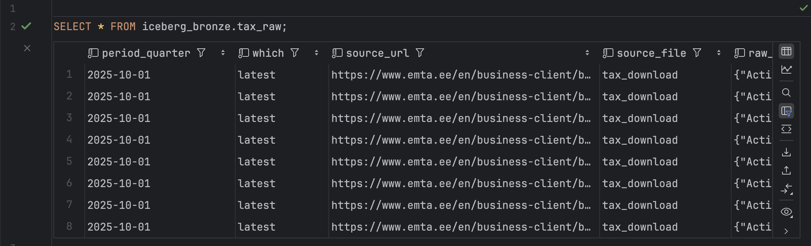
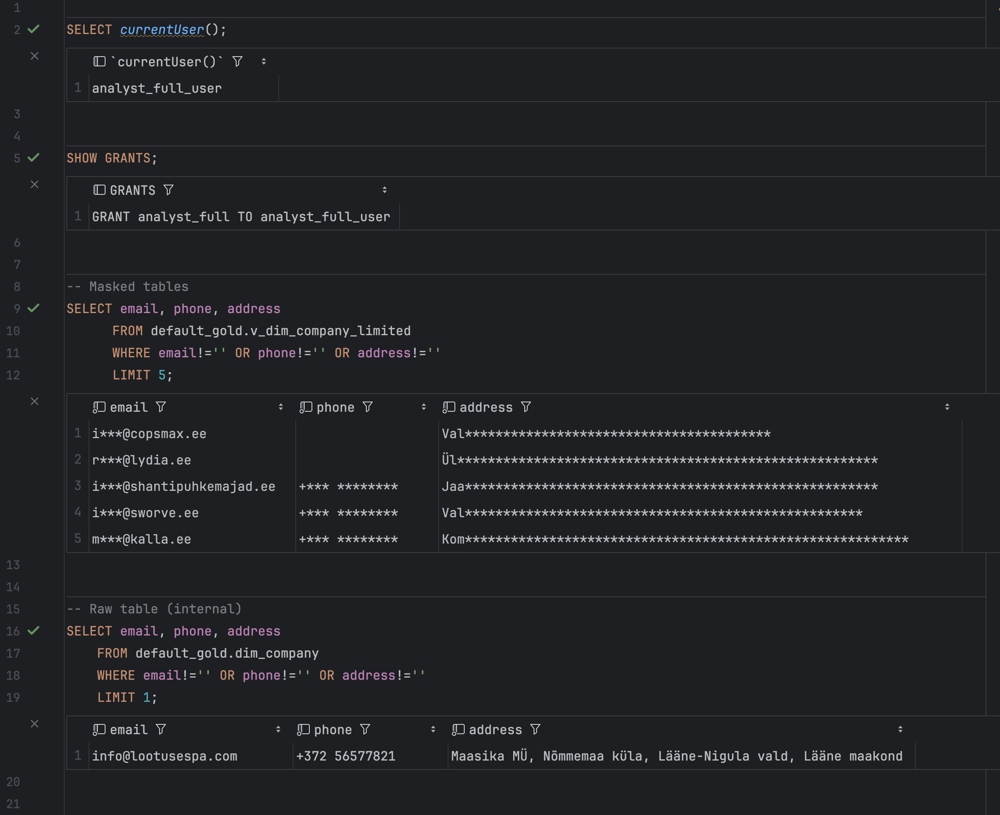
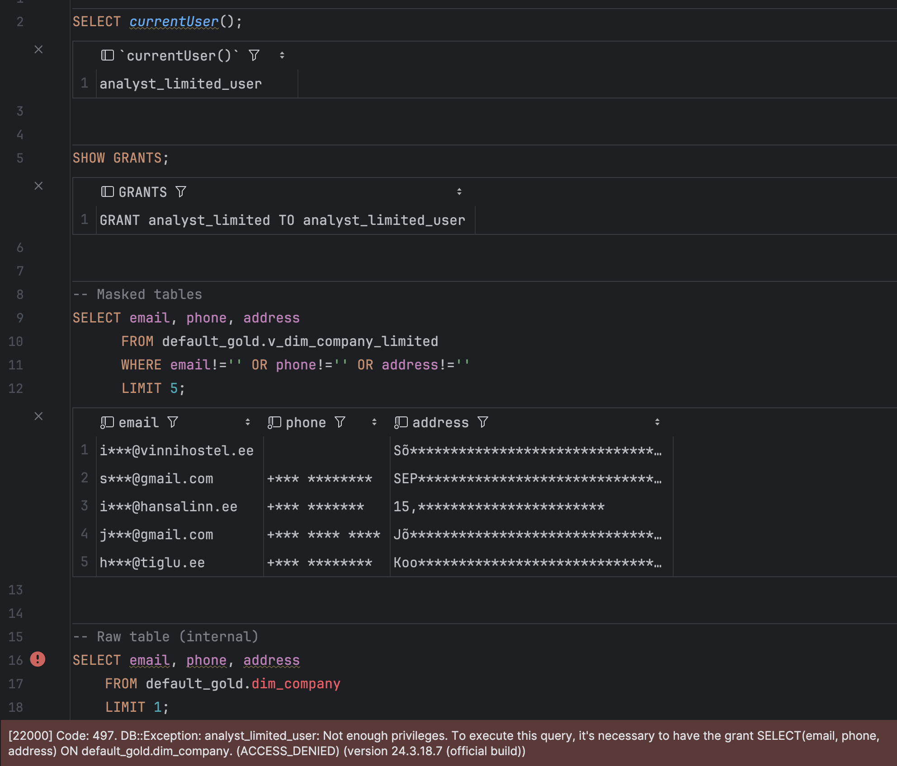
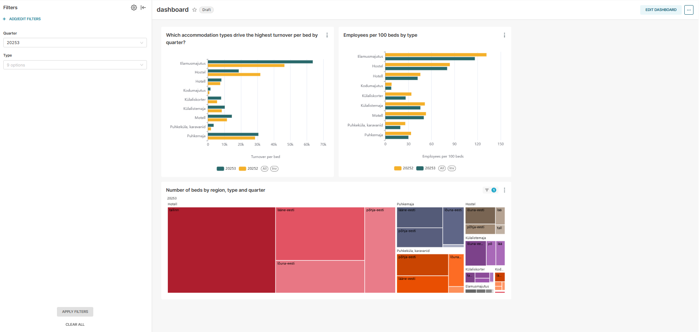
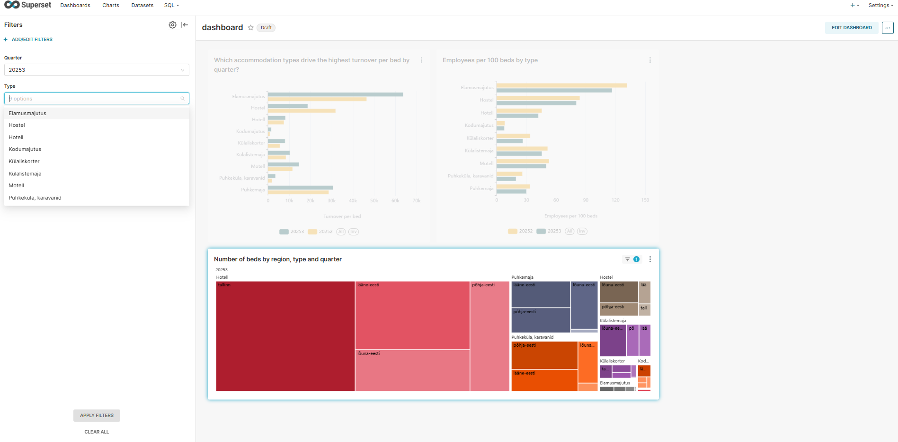

# First run
```
docker compose build
docker compose up -d

> Now run all Airflow DAGs in order:
tax_quarterly_dag → iceberg_tax_bronze_dag → housing_monthly_dag → silver_dag → gold_dag
```
> Note: Delete all old build, images, volumes just in case there are corrupted existing Docker files


## Apache Iceberg

* Our iceberg_tax_bronze_dag is built similarly as tax_quarterly_dag, but it creates the table inside Apache Iceberg database.
* Our tax_quarterly_dag works just as before, relying on clickhouse tables, but additionally populates tax_raw table from Iceberg database, making it queryable from Clickhouse iceberg_bronze schema.
  * Future wise best practice would be to use Iceberg as source for tax_raw as it would be from a Iceberg Data Lake, but our solution passes the needed requirements.


### Iceberg bronze layer tax table query from Clickhouse
Runnable in clickhouse client or through IDE Database Connector:
```
SELECT * FROM iceberg_bronze.tax_raw;
```
Result:
```
| period_quarter | which  | source_url                                                                                                               | source_file  | raw_json                                                                                                                                                                                                                                                                                                                                                                                                                                                                                                                                                                                                                                                                                                                                                                                                                                                     | record_hash                                                         | ingested_at              |
|:---------------|:-------|:-------------------------------------------------------------------------------------------------------------------------|:-------------|:---------------------------------------------------------------------------------------------------------------------------------------------------------------------------------------------------------------------------------------------------------------------------------------------------------------------------------------------------------------------------------------------------------------------------------------------------------------------------------------------------------------------------------------------------------------------------------------------------------------------------------------------------------------------------------------------------------------------------------------------------------------------------------------------------------------------------------------------------------------|:--------------------------------------------------------------------|:-------------------------|
| 2025-10-01     | latest | https://www.emta.ee/en/business-client/board-news-and-contact/news-press-information-statistics/statistics-and-open-data | tax_download | {"Activity": "PROFESSIONAL, SCIENTIFIC AND TECHNICAL ACTIVITIES", "County": null, "Data date": "10.10.2025", "Labour taxes and payments I qtr": 1178.0, "Labour taxes and payments II qtr": NaN, "Labour taxes and payments III qtr": 1210.0, "Labour taxes and payments IV qtr": 2059.0, "Name": "DM DIGI MEDIA GROUP OY", "Number of employees I qtr": NaN, "Number of employees II qtr": 1.0, "Number of employees III qtr": 1.0, "Number of employees IV qtr": 1.0, "Registry code": "60432443", "State taxes I qtr": 1137.0, "State taxes II qtr": NaN, "State taxes III qtr": 1141.0, "State taxes IV qtr": 1956.0, "Turnover I qtr": NaN, "Turnover II qtr": NaN, "Turnover III qtr": NaN, "Turnover IV qtr": NaN, "Type": "Non-resident", "Year": 2024}                                                                                                    | ae3118261bedd7f5aafe43c0672e3e7d88cdee8e51e9d18c18be8e88e2eef542 | 2025-11-30 18:29:44.628 |
| 2025-10-01     | latest | https://www.emta.ee/en/business-client/board-news-and-contact/news-press-information-statistics/statistics-and-open-data | tax_download | {"Activity": "ACCOMMODATION AND FOOD SERVICE ACTIVITIES", "County": "Lääne-Viru ( Haljala vald )", "Data date": "10.10.2025", "Labour taxes and payments I qtr": NaN, "Labour taxes and payments II qtr": NaN, "Labour taxes and payments III qtr": NaN, "Labour taxes and payments IV qtr": NaN, "Name": "MERI & MAITSED OÜ", "Number of employees I qtr": NaN, "Number of employees II qtr": NaN, "Number of employees III qtr": NaN, "Number of employees IV qtr": NaN, "Registry code": "17319131", "State taxes I qtr": NaN, "State taxes II qtr": NaN, "State taxes III qtr": NaN, "State taxes IV qtr": NaN, "Turnover I qtr": NaN, "Turnover II qtr": NaN, "Turnover III qtr": NaN, "Turnover IV qtr": NaN, "Type": "Company", "Year": 2025}                                                                                                                                                                          | ae32784e726e3839637d9839a22b1c822868e9deeb9bede31feff893cdd2a953 | 2025-11-30 18:29:44.628 |
| 2025-10-01     | latest | https://www.emta.ee/en/business-client/board-news-and-contact/news-press-information-statistics/statistics-and-open-data | tax_download | {"Activity": "PROFESSIONAL, SCIENTIFIC AND TECHNICAL ACTIVITIES", "County": null, "Data date": "10.10.2025", "Labour taxes and payments I qtr": NaN, "Labour taxes and payments II qtr": NaN, "Labour taxes and payments III qtr": NaN, "Labour taxes and payments IV qtr": 0.0, "Name": "THE COOKWARE COMPANY EUROPE", "Number of employees I qtr": NaN, "Number of employees II qtr": NaN, "Number of employees III qtr": NaN, "Number of employees IV qtr": NaN, "Registry code": 65740478, "State taxes I qtr": NaN, "State taxes II qtr": NaN, "State taxes III qtr": NaN, "State taxes IV qtr": 0.0, "Turnover I qtr": NaN, "Turnover II qtr": NaN, "Turnover III qtr": NaN, "Turnover IV qtr": NaN, "Type": "Non-resident", "Year": 2024}                                                                                                                                                             | ae32d2b9a4e4ba4a412cf9418079e7fe6037a2ccdf81b52a166a88899b566e20 | 2025-11-30 18:29:44.628 |
| 2025-10-01     | latest | https://www.emta.ee/en/business-client/board-news-and-contact/news-press-information-statistics/statistics-and-open-data | tax_download | {"Activity": "ARTS, ENTERTAINMENT AND RECREATION", "County": "Tartu ( Peipsiääre vald )", "Data date": "10.10.2025", "Labour taxes and payments I qtr": NaN, "Labour taxes and payments II qtr": NaN, "Labour taxes and payments III qtr": NaN, "Labour taxes and payments IV qtr": NaN, "Name": "KOOSA RAAMATUKOGU - PEIPSIÄÄRE VALLA KESKRAAMATUKOGU", "Number of employees I qtr": 9.0, "Number of employees II qtr": 9.0, "Number of employees III qtr": 9.0, "Number of employees IV qtr": NaN, "Registry code": 75009094, "State taxes I qtr": NaN, "State taxes II qtr": NaN, "State taxes III qtr": NaN, "State taxes IV qtr": NaN, "Turnover I qtr": NaN, "Turnover II qtr": NaN, "Turnover III qtr": NaN, "Turnover IV qtr": NaN, "Type": "Government or state authority", "Year": 2025}                                                                                           | ae332757397cfd6155d88bad128be1930316efeec4086cc5badeee1a82339f80 | 2025-11-30 18:29:44.628 |
| 2025-10-01     | latest | https://www.emta.ee/en/business-client/board-news-and-contact/news-press-information-statistics/statistics-and-open-data | tax_download | {"Activity": null, "County": null, "Data date": "10.10.2025", "Labour taxes and payments I qtr": 0.0, "Labour taxes and payments II qtr": NaN, "Labour taxes and payments III qtr": 0.0, "Labour taxes and payments IV qtr": NaN, "Name": "BALAGAN SPÓŁKA Z OGRANICZONĄ ODPOWIEDZIALNOŚCIĄ", "Number of employees I qtr": NaN, "Number of employees II qtr": NaN, "Number of employees III qtr": NaN, "Number of employees IV qtr": NaN, "Registry code": 65708431, "State taxes I qtr": 110.0, "State taxes II qtr": NaN, "State taxes III qtr": 34.0, "State taxes IV qtr": NaN, "Turnover I qtr": NaN, "Turnover II qtr": NaN, "Turnover III qtr": NaN, "Turnover IV qtr": NaN, "Type": "Non-resident", "Year": 2025}                                                                                                                                     | ae347b8b2964dd467f550cc0676e655eae88a16cfeceb867e12b2bb6a7e5f21d | 2025-11-30 18:29:44.628 |
```

Picture proof of result:



## Grant accessed and create views

### SQL files can be found in `tourism-dwh/airflow/include/secrets/`

### 1) Roles & users
`docker exec -i clickhouse bash -lc 'clickhouse-client -n' < airflow/include/security/01_roles_and_users.sql`

### 2) Full-access views
`docker exec -i clickhouse bash -lc 'clickhouse-client -n' < airflow/include/security/02_views_full.sql`

### 3) Masked table + limited view
`docker exec -i clickhouse bash -lc 'clickhouse-client -n' < airflow/include/security/03_views_masked.sql`

### 4) Grants
`docker exec -i clickhouse bash -lc 'clickhouse-client -n' < airflow/include/security/04_grants_on_views.sql`

### Login to analyst_full_user
```
docker exec -it clickhouse clickhouse-client \
  --user analyst_full_user --password full123
```
### Login to analyst_limited_user
```
docker exec -it clickhouse clickhouse-client \
  --user analyst_limited_user --password limited123
```
### Query masked table
Note: not actually sensitive data columns – company email, phone, address
```
SELECT email, phone, address
      FROM default_gold.dim_company
      WHERE email!='' OR phone!='' OR address!=''
      LIMIT 5
```
### Query limited table (with both users)
```
SELECT email, phone, address FROM default_gold.dim_company LIMIT 1
```

### Login creds to access superset/superset.db

### Pictures of results
Full analyst query results:

Limited analyst query results:

* Limited analyst has no access to our internal dim view.

## Openmetadata 
Most recent progress can be found on branch omd-2, as there were some issues unsolved regarding Openmetadata and Clickhouse migration as well as data ingestion. Took 30+ hours for Tarvet Kullmann and 20+ hours for Ron-Aaron Vahtra. Unfortunately with no successful complete results, therefore code is not integrated to main branch. 

As some of the requirements got fulfilled, please review [this branch](https://github.com/ronv3/data-eng-group12/blob/omd_2/tourism-dwh) for progress and results.

## Superset BI Dashboard
Guide for run:
* After running all Airflow DAGs, run this again (this populates based on gold views)
* May have problems because of mismatching credentials to clickhouse database, with which the Superset Dashboard was created with.
  * Instead, rely on images below and code analysis (sorry, not much to do!)



* Views based on Gold tables, configurable by filter (seen on the left)

